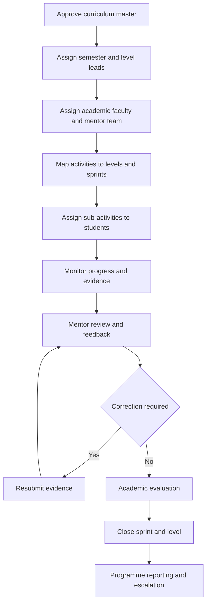

# MSDSP Course Coordination Plan

## Document Purpose

This document defines the coordination, mentorship and academic-alignment model for the MSc Data Science and Product Development Work Integrated Learning Programme at the Centre for Digital Innovation and Product Development, Digital University Kerala.

It is structured for use by an LLM, programme portal, course-planning module, mentor dashboard, faculty workspace or administrative workflow.

## Interpretation Rules

- This file defines people, responsibilities and coordination assignments.
- Curriculum files define courses, activities, sub-activities, evidence requirements, points or hours, and evaluation standards.
- Coordination records must reference approved curriculum records rather than duplicate or modify them.
- A lead coordinator manages the operation of an assigned level.
- Support mentors provide discipline-specific guidance and reviews.
- The sprint coordinator manages weekly sprint cadence across levels.
- Academic faculty retain ownership of elective delivery and credit-bearing assessment.
- CDIPD members provide industry mentorship for electives.
- A value marked `GAP` indicates that the required specialist is not available in the current team.
- Progress tracked in the programme portal must not be interpreted as attendance.

## Programme Structure

```text
MSDSP Programme
  -> 4 Semesters
      -> 20 Levels
          -> 5 Levels per Semester
              -> Weekly Sprints
                  -> Course Activities
                      -> Sub-Activities
                          -> Student Evidence
                              -> Mentor Review
                                  -> Academic Evaluation
```

## Coordination Structure

```text
Programme Governance
  -> Semester Coordination
      -> Level Lead Coordinator
          -> Support Mentor Team
              -> Activity or Sub-Activity Mentor
                  -> Student or Student Team

Cross-Cutting Roles
  -> Sprint Coordinator
  -> Academic Faculty
  -> Industry Mentor
  -> Quality Reviewer
  -> Evaluation Panel
  -> Student Success and Placement Support
```

## Programme Metadata

- **Programme:** MSc Data Science and Product Development
- **Delivery Model:** Work Integrated Learning Programme
- **Centre:** Centre for Digital Innovation and Product Development
- **University:** Digital University Kerala
- **CDIPD Team Members:** 16
- **Semesters:** 4
- **Levels:** 20
- **Levels per Semester:** 5

# Team Roster

| No. | Team Member | Designation | Primary Discipline |
|---:|---|---|---|
| 1 | Arun Kumar Balakrishnan | Senior Project Manager - Enterprise Systems | Programme Governance |
| 2 | Soorya Krishnan G | Software Project Manager, CDIPD | Agile and Sprint Cadence |
| 3 | Krishnasree K | Team Lead - Java; Project Manager | Backend and Java; Delivery Management |
| 4 | Vyga V R | Senior Business Analyst | Requirements and Research |
| 5 | Smitha Surendran | Manager - HR | Programme Administration and Student Success |
| 6 | Anoop Raj R V | Technical Lead - Database Systems | Data and Database Engineering |
| 7 | Nidheesh G | Database Administrator | Database Administration |
| 8 | Arun Nadh G | Senior Architect - Cloud, Infrastructure and DevOps | Cloud and DevOps |
| 9 | Abhi Krishnan R | Lead UI/UX Developer-1 | UI/UX and Product Design |
| 10 | Prasanth Lal S N | Senior Front End Developer | UI and Frontend Development |
| 11 | Maneesh George Johnson | Senior Front End Developer | UI and Frontend Development |
| 12 | Ajitha V S | Technical Lead - QA and Testing; Project Manager | Quality Assurance and Test Automation |
| 13 | Soorya S Kumar | Team Lead - Java, Product Development Center | Backend and Java |
| 14 | Sridas D | Software Solution Architect | Solution Architecture |
| 15 | Diju M | Senior Software Engineer - Java | Backend and Code Review |
| 16 | Bibin Babu | Senior Software Engineer - Mobile Apps | Mobile and Cross-Platform Frontend |

# Team to Curriculum Mapping

| Team Member | Course Focus | Level Focus | Certification or Track Owned |
|---|---|---|---|
| Sridas D | CS102 Architecture | L2, L5, L9, L18 | Architecture reviews and blueprint sign-off |
| Arun Kumar Balakrishnan | Process | L16-L20 | CMMI Associate, documentation and process |
| Soorya Krishnan G | Weekly sprints across the programme | All levels; specific focus on L17 | Agile Scrum and Certified Scrum Master |
| Vyga V R | Research and Product | L1, L3, L4, L16, L19 | Market and user research; industry liaison |
| Smitha Surendran | Non-academic support and Placement | L1, L16-L20 | Student success and industry placement |
| Anoop Raj R V | CS103; CS1101 elective | L6, L7, L13 | MongoDB, Google Professional Data Engineer and big data using Spark or Flink |
| Nidheesh G | CS103 and Governance | L6, L14 for privacy | Database administration and data governance |
| Arun Nadh G | CS105 DevOps; CS102 Cloud | L10, L12-L15 | AWS CLF, AWS SAA, AWS DOP, GCP ACE, CKA, Docker and GitHub Actions |
| Abhi Krishnan R | CS102 Frontend | L4, L5 | UI/UX, Figma and frontend |
| Prasanth Lal S N | CS102; CS601 elective | L4, L5, L9 | Frontend and React or Next.js frameworks |
| Maneesh George Johnson | CS102; CS601 elective | L5, L17 | React, Next.js and advanced frontend frameworks |
| Ajitha V S | CS105 and Quality | L8, L9, L15 | Test automation, CI/CD testing and QA sign-off |
| Soorya S Kumar | CS103 and CS104 | L8, L11 | Postman API and backend track |
| Krishnasree K | CS104 and Delivery | L9, L12 | API, microservices, sprint management and delivery management |
| Diju M | Sprint Builds | L8-L12 | Peer review and code-review facilitation |
| Bibin Babu | CS102 Frontend for Mobile | L5, L17, L18 | React Native and mobile build |

# Level Coordination Assignments

## Semester 1

| Level | Title | Lead Coordinator | Support Mentors | Key Certifications |
|---:|---|---|---|---|
| 1 | Orientation and Foundations | Vyga V R | Soorya Krishnan G; Smitha Surendran | Git and GitHub |
| 2 | AI and Architecture Deep Dive | Requires confirmation | AI/ML SME `GAP` | None specified |
| 3 | Electives and Market Research | Vyga V R | Abhi Krishnan R | Agile Scrum |
| 4 | Technology Stack, UX and Certification | Abhi Krishnan R | Prasanth Lal S N; Arun Nadh G | AWS CLF; Google UX |
| 5 | Blueprint and Semester I Evaluation | Sridas D | Abhi Krishnan R; Prasanth Lal S N; Maneesh George Johnson; Bibin Babu | Meta Front-End |

## Semester 2

| Level | Title | Lead Coordinator | Support Mentors | Key Certifications |
|---:|---|---|---|---|
| 6 | Backend Foundations and Data | Anoop Raj R V | Soorya S Kumar; Nidheesh G | Docker |
| 7 | AI Model Training and DevOps | AI/ML SME `GAP` | Anoop Raj R V; Arun Nadh G | MongoDB; TensorFlow |
| 8 | Electives, APIs and Certification | Soorya S Kumar | Diju M; Ajitha V S | GitHub Actions; Postman |
| 9 | Full-Stack Integration and Testing | Krishnasree K | Sridas D; Prasanth Lal S N; Ajitha V S | AWS SAA |
| 10 | Local Deployment and Semester II Evaluation | Arun Nadh G | Arun Kumar Balakrishnan | None specified |

## Semester 3

| Level | Title | Lead Coordinator | Support Mentors | Key Certifications |
|---:|---|---|---|---|
| 11 | API Design and Microservices | Soorya S Kumar | Sridas D | None specified |
| 12 | Third-Party Integration and Certifications | Krishnasree K | Arun Nadh G; Diju M | CKA; GCP ACE |
| 13 | Cloud Deployment and MLOps | Arun Nadh G | Anoop Raj R V | Databricks MLOps |
| 14 | Security, Governance and Live Product | Arun Nadh G | Nidheesh G; Security SME `GAP` | CEH |
| 15 | Product Hardening and Semester III Evaluation | Arun Nadh G | Arun Kumar Balakrishnan; Ajitha V S | AWS DevOps Professional |

## Semester 4

| Level | Title | Lead Coordinator | Support Mentors | Key Certifications |
|---:|---|---|---|---|
| 16 | Final Project Scoping | Arun Kumar Balakrishnan | Vyga V R; Smitha Surendran | Azure AI-102 |
| 17 | Product Build and Certification Sprint | Soorya Krishnan G | Soorya S Kumar; Krishnasree K; Maneesh George Johnson; Bibin Babu | Certified Scrum Master |
| 18 | Advanced Features and Expert Review | Sridas D | Diju M; Bibin Babu | AWS Machine Learning Specialty |
| 19 | Report and Industry Evaluation | Arun Kumar Balakrishnan | Vyga V R; Smitha Surendran | Google Professional Data Engineer |
| 20 | Final Viva and Convocation | Arun Kumar Balakrishnan | Sridas D; Arun Nadh G | CMMI Associate |

# Course Academic and Mentor Alignment

## Ownership Rule

Academic faculty own course delivery and credit-bearing assessment. CDIPD members act as industry mentors who provide technical guidance, practical reviews, implementation support and industry context.

Industry mentors must not independently change approved academic outcomes, assessment criteria or final grades.

## Core Course Mapping

| Course Code | Course Title | Description | Academic Faculty | Semester | CDIPD Mentor Alignment |
|---|---|---|---|---|---|
| CS101 | Advanced AI & Machine Learning | Deep learning foundations, Transformers, scalable ML | Dr Manoj Kumar | Semester I | AI/ML SME `GAP` for modelling; Sridas D for architecture; Arun Nadh G for deployment & DevOps |
| CS102 | Full Stack Architecture & Cloud-Native Development | Modern full-stack, APIs, containerized delivery & serverless | Dr Ajith Kumar | Semester I | Sridas D; Abhi Krishnan R; Prasanth Lal S N; Maneesh George Johnson; Bibin Babu; Arun Nadh G |

## Elective Mapping

| Course Code | Elective | Description | Academic Faculty | Semester | CDIPD Mentor Alignment |
|---|---|---|---|---|---|
| CS501 | AI Ethics and Governance | Bias mitigation and compliance | Dr Manoj Kumar, Dr Ajith Kumar | Semester I | Arun Kumar Balakrishnan for governance; Nidheesh G for data privacy; AI/ML SME `GAP` for modelling ethics |
| CS601 | Advanced Frontend Frameworks | Deep dive into React, Next.js or Vue | Dr Ajith Kumar | Semester I | Abhi Krishnan R, Prasanth Lal S N and Maneesh George Johnson for React or Next.js; Bibin Babu for mobile |
| CS1101 | Big Data Analytics | Processing massive datasets with Spark or Flink | Dr Manoj Kumar | Semester I | Anoop Raj R V as data lead; AI/ML SME `GAP` for analytics modelling |

# Semester Coordination Summary

| Semester | Focus | Primary Leads | Supporting Team |
|---|---|---|---|
| Semester I | Research, UX, frontend, architecture blueprint and electives | Vyga V R; Abhi Krishnan R; Sridas D | Prasanth Lal S N; Maneesh George Johnson; Smitha Surendran; academic faculty for CS501, CS601 and CS1101 |
| Semester II | Backend, data, APIs, full-stack integration and testing | Soorya S Kumar; Krishnasree K; Anoop Raj R V | Data team; Cloud and DevOps team; Ajitha V S for QA |
| Semester III | Microservices, cloud, MLOps, security and product hardening | Arun Nadh G; Anoop Raj R V; Nidheesh G | Cloud and DevOps team; Data team; Ajitha V S for QA |
| Semester IV | Final product, industry placement, evaluation and viva | Arun Kumar Balakrishnan; Sridas D; evaluation panel | Programme committee; Smitha Surendran for placement and HR; Maneesh George Johnson and Bibin Babu for frontend and mobile |

# Role Definitions for System Use

## Programme Governance Lead

Responsibilities:

- Monitor overall programme delivery.
- Maintain process and documentation standards.
- Coordinate escalations across semesters and levels.
- Monitor staffing and specialist gaps.
- Support final evaluation, viva and programme closure.

## Academic Faculty

Responsibilities:

- Own the approved course or elective.
- Approve curriculum delivery and assessment.
- Define or approve credit-bearing evaluation decisions.
- Review academic exceptions and final grades.

## Level Lead Coordinator

Responsibilities:

- Plan and coordinate the assigned level.
- Map approved course activities to level schedules.
- Coordinate support mentors and checkpoints.
- Monitor completion, evidence coverage, review status and exceptions.
- Escalate unresolved academic, technical or operational issues.
- Close the level after required reviews and evaluations are complete.

## Sprint Coordinator

Responsibilities:

- Maintain weekly sprint cadence across levels.
- Coordinate sprint planning and closure.
- Track blockers, dependencies and missed checkpoints.
- Facilitate cross-team coordination.
- Report delivery risks to level and programme leads.

The sprint coordinator does not replace academic faculty, level coordinators or technical reviewers.

## Support Mentor

Responsibilities:

- Provide specialist guidance for assigned activities or sub-activities.
- Review student evidence within the assigned discipline.
- Record feedback and request corrections or resubmissions.
- Identify technical risks and student support needs.
- Escalate decisions outside the mentor's authority.

## Quality Reviewer

Responsibilities:

- Review testing strategy and evidence.
- Verify quality gates and defect closure.
- Confirm that required testing is repeatable and traceable.
- Provide QA sign-off where assigned.

## Student Success and Placement Support

Responsibilities:

- Support onboarding and programme administration.
- Identify student support requirements.
- Coordinate placement and industry engagement.
- Support final-project and transition activities.

# Recommended Portal Data Relationships

```text
TeamMember
  -> has Discipline and Designation
  -> has CourseFocus assignments
  -> has LevelFocus assignments
  -> has CertificationTrack assignments

Semester
  -> contains Levels

Level
  -> has one LeadCoordinator
  -> has many SupportMentors
  -> references CourseActivities
  -> contains WeeklySprints

Course
  -> has AcademicOwner where applicable
  -> has IndustryMentors
  -> contains Activities

Activity
  -> contains SubActivities
  -> can be assigned to a Level or Sprint

SubActivity
  -> can be assigned to Students
  -> requires Evidence
  -> receives MentorReview
  -> contributes to AcademicEvaluation
```

# Recommended Coordination Lifecycle



# Authority Boundaries

| Decision | Primary Authority | Supporting Roles |
|---|---|---|
| Curriculum content | Academic authority and approved curriculum owner | Course coordinators and subject experts |
| Level scheduling | Level lead coordinator | Sprint coordinator and support mentors |
| Weekly sprint cadence | Sprint coordinator | Level lead and mentor team |
| Technical mentoring | Assigned industry mentor | Level lead and course owner |
| Evidence review | Assigned mentor or reviewer | Level lead and academic faculty |
| Credit-bearing assessment | Academic faculty | Mentors and evaluation panel |
| QA sign-off | Assigned quality reviewer | Technical mentors and level lead |
| Architecture sign-off | Assigned solution architect | Technical leads and course owner |
| Final viva and programme closure | Academic and programme evaluation panel | Programme governance and specialist reviewers |

# Identified Resource Gaps

## AI and Machine Learning Specialist

Status: `GAP`

Required for:

- Level 2 AI and Architecture Deep Dive
- Level 7 AI Model Training and DevOps
- CS501 modelling-ethics mentorship
- CS1101 analytics-modelling mentorship

## Security Specialist

Status: `GAP`

Required for:

- Level 14 Security, Governance and Live Product
- Security review and product hardening
- Specialist security guidance and assessment support

# Items Requiring Confirmation

1. **Level 2 lead coordinator:** The team-to-curriculum mapping assigns Sridas D to Level 2, but the level assignment table leaves the lead coordinator blank and lists only an AI/ML specialist gap.
2. **AI/ML specialist allocation:** Confirm whether this will be a new team member, visiting academic, external mentor or shared institutional resource.
3. **Security specialist allocation:** Confirm the responsible person or external support model for Level 14.
4. **Course-head assignments:** Confirmed for CS101 (Dr Manoj Kumar), CS102 (Dr Ajith Kumar), CS501 (Dr Manoj Kumar, Dr Ajith Kumar), and CS601 (Dr Ajith Kumar). CS1101 aligned with Dr Manoj Kumar.
5. **Review authority:** Confirm which mentor roles may approve, request resubmission or only recommend an academic decision.
6. **Final evaluation panel:** Confirm membership, quorum and approval authority.
7. **Certification ownership:** Confirm whether listed certifications are mandatory, recommended or merely aligned with the level.
8. **Name normalization:** Use full team-member names consistently instead of abbreviated forms such as `Arun Kumar B.` in operational data.

# Rules for an LLM

- Do not invent team members, academic faculty or specialist assignments.
- Preserve full names, designations, course codes, level numbers and semester mappings.
- Treat `GAP` as an unfilled role, not as a person's name.
- Keep academic-faculty authority separate from industry-mentor responsibilities.
- Do not infer that a mentor can award academic grades unless explicitly authorized.
- Do not duplicate activities or sub-activities inside the coordination model.
- When generating assignments, reference the approved curriculum activity or sub-activity ID.
- When generating dashboards, distinguish academic ownership, operational coordination, mentoring, review and escalation.
- Surface unresolved specialist gaps and unassigned roles clearly.
- Mark conflicting or missing source information as `Requires confirmation`.

# Source Note

Prepared from the MSDSP Course Coordination Plan issued by the Centre for Digital Innovation and Product Development, a CMMI Level 3 Certified Center of Excellence at Digital University Kerala.
